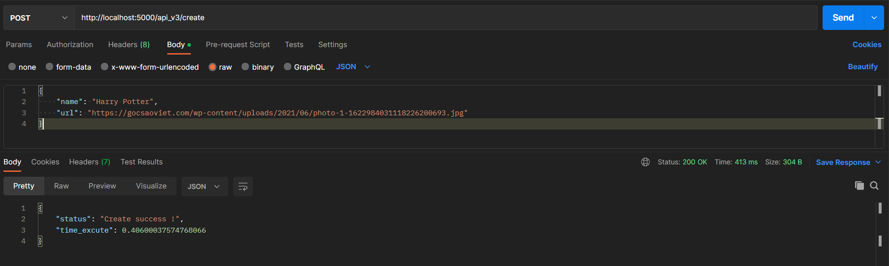
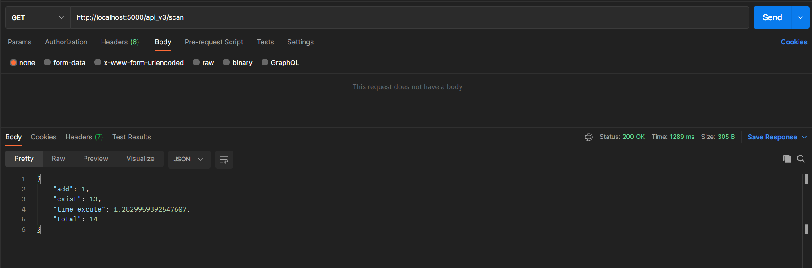
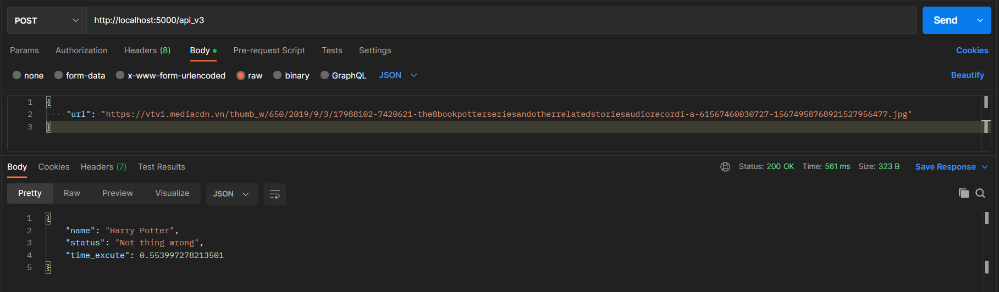

# Face Regconition
<br>
<div align='center'>
      
</div>
<br>

This is the project face recognition using [MTCNN](https://github.com/ipazc/mtcnn) to handle scan function, [ultralight](https://github.com/Linzaer/Ultra-Light-Fast-Generic-Face-Detector-1MB) to detect face and [ArcFace](https://github.com/deepinsight/insightface) to recognition.

Supported by the F-Code club.

<br>

# Introduction

In this face recognition problem, I use a [Learning Similarity](https://en.wikipedia.org/wiki/Similarity_learning) method so that I don't have to retrain the model when add a new face.

<br>

# How to setup!
```
$ git clone https://github.com/ttthanhf/face-recognition.git
```
```
$ pip3 install -r requirements.txt"
```
- Download weights : [Click here to download weights](https://drive.google.com/drive/folders/1uimIp4K-AAjk5EQBuVI8j9OYBgJCSUES?usp=sharing) (Put arcface_h5 folder and ultralight_onnx folder in weights folder)
<br><br><br>

# To start server:
```
$ py main.py server start
```
> (It will start localhost with port 5000)

>*~If your computer has 16gb ram or more you can use docker to run this model !~*

<br>

# API
> using json in body web request.

- api_v1 : using upload image.
- api_v2 : using path of image in local. (Body: Json: {path: "your url", name: "your name"})
- api_v3 : using url of image. (Body: Json: {url: "your url", name: "your name"})

<hr>
<br>

- / (method: POST) : recognition face
> Input: (*look*)
```
=> Output { status , 
            name , 
            execute_time 
          }
```
<br>

- /create (method: POST) : insert new image
```
=> Output { status , 
            execute_time
          }
```
<br>

- /add (method: POST) : add more image
```
=> Output { status , 
            execute_time 
          }
```
<br>

- /delete (method POST) : delete data user
> Input: json ({name: "your name"})
```
> => Output { status , 
              execute_time 
            }
```
<br>

- /scan (method: GET) : generate data face
```
> => Output { add , 
              exist , 
              total , 
              execute_time 
            }
```
<br>

- /list (method: GET) : show all user
```
> => Output { 
               *json list* 
            }
```
<br>

- /rename (method POST) : rename user in database
> Input: Json ({oldname: "your oldname", newname: "your newname"})
```
> => Output { status , 
              execute_time 
            }
```
<br>

# Example
To easily interact with users as well as being able to add one project to another, I use RESTful API to interact with Model.

*I use POSTMAN for this example with api_v3*

<div align="center">
POSTMAN
            
<strong>Step 1</strong>: create a new face to start recognition. Here I use the image of Harry Potter character.
            
*(link: https://gocsaoviet.com/wp-content/uploads/2021/06/photo-1-1622984031118226200693.jpg)*
            

</div>
<br>

```
url: http://localhost:5000/api_v3/create (method POST)
```   

<br>

<div align="center">
<strong>Step 2</strong> : Use "scan" to generate the face data into database.
            

</div>
<br>

```
url: http://localhost:5000/api_v3/scan (method GET)
```

<br>

<div align="center">
<strong>Step 3</strong> : Result.
            
*(link: https://vtv1.mediacdn.vn/thumb_w/650/2019/9/3/17988102-7420621-the8bookpotterseriesandotherrelatedstoriesaudiorecordi-a-61567460030727-15674958768921527956477.jpg)*


</div>

<br>

*Example in folder webapp (it using fetch or axios)

# Note
! You need to scan face before create new face !
<br><br>
! => To avoid unexpected errors, use the python version 3.7.9 <= !
<br><br>
Ff you are in python 3.7.9 and still not working, delete that python version and reinstall it. [Python 3.7.9](https://www.python.org/downloads/release/python-379/)
<br>

# Reference : 
- https://github.com/ipazc/mtcnn
- https://github.com/serengil/deepface
- https://github.com/deepinsight/insightface
- https://github.com/davidsandberg/facenet/
- https://github.com/Linzaer/Ultra-Light-Fast-Generic-Face-Detector-1MB
- https://viblo.asia/p/paper-explained-some-face-recognition-approaches-facenet-arcface-cosface-Do754zgLZM6

# Contact
if you have any problem, you can contact to me ! :)

# License
This project is licensed under the MIT License - see [MIT LICENSE](LICENSE) for more details.


